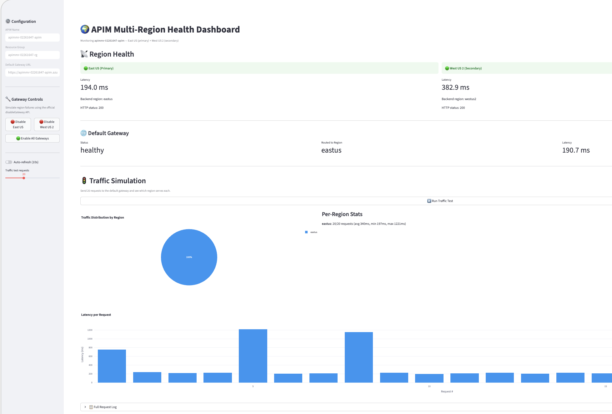

# APIM Multi-Region Failover Demo

> **"Prove your API gateway survives a region failure — before your customers have to."**

This repository demonstrates how **Azure API Management Premium** handles multi-region deployment with automatic failover. Built in the style of the [api-modernization-with-mcp](https://github.com/odaibert/api-modernization-with-mcp) repository, with a hands-on **Jupyter notebook** that deploys real Azure infrastructure via Bicep and a **Streamlit dashboard** for live region health monitoring.



## 🚀 Labs

| Lab | Description | Status |
|-----|-------------|--------|
| [Multi-Region Failover](labs/multi-region-failover/) | Deploy APIM Premium across two regions, test health, simulate DR scenarios | ✅ Ready |

## Why Multi-Region APIM?

Azure API Management Premium tier supports deploying API gateways across multiple Azure regions:

- 🌍 **Reduced latency** — Requests are routed to the nearest regional gateway automatically
- 🛡️ **High availability** — If one region goes offline, traffic fails over to the next closest gateway
- 🔄 **DR drills** — Use `disableGateway` to simulate region failures without touching infrastructure
- 📊 **Observability** — Monitor each region independently through Application Insights
- ⚙️ **Policy sync** — API definitions and policies propagate to all regions automatically

## Architecture

```
+--------------------------------------------------------------------------+
|                          Azure Resource Group                            |
|                                                                          |
|  +----------------------------+    +----------------------------------+  |
|  |  Azure API Management      |    |  Monitoring                      |  |
|  |  (Premium SKU)             |    |  Log Analytics + App Insights    |  |
|  |                            |    +----------------------------------+  |
|  |  Primary: East US          |                                          |
|  |  Secondary: West US 2      |                                          |
|  |                            |                                          |
|  |  API: /health, /echo       |                                          |
|  |  Policy: region-routing    |                                          |
|  +---+------------------+----+                                           |
|      |                  |                                                |
|      v                  v                                                |
|  +---+------------+  +--+-------------+                                  |
|  | Container App  |  | Container App  |                                  |
|  | East US        |  | West US 2      |                                  |
|  | Health API     |  | Health API     |                                  |
|  | (FastAPI)      |  | (FastAPI)      |                                  |
|  +----------------+  +----------------+                                  |
|                                                                          |
+--------------------------------------------------------------------------+
         |                    |                   |
  +------+------+   +--------+--------+   +------+------+
  | Jupyter     |   | Streamlit       |   | curl /      |
  | Notebook    |   | Dashboard       |   | browser     |
  | (lab cells) |   | (live health)   |   |             |
  +-------------+   +-----------------+   +-------------+
```

**Data flow:** Clients hit the APIM default gateway → APIM routes to the nearest regional gateway (East US or West US 2) → the regional gateway uses `context.Deployment.Region` policy to call the local Container App backend → the backend returns its region identity. When a gateway is disabled, traffic automatically fails over to the remaining active region.

## What Gets Deployed

| Resource | Purpose |
|----------|---------|
| **Azure API Management (Premium)** | Multi-region gateway — East US (primary) + West US 2 (secondary) |
| **Container App — East US** | Health/echo API backend reporting `"region": "eastus"` |
| **Container App — West US 2** | Health/echo API backend reporting `"region": "westus2"` |
| **Log Analytics + App Insights** | Centralized observability across both regions |

## Repository Structure

```
apim-multiregion-test/
├── labs/
│   └── multi-region-failover/
│       ├── multi-region-failover.ipynb   # Main lab notebook (Run All)
│       ├── main.bicep                    # Orchestrator Bicep template
│       ├── policy.xml                    # APIM region-routing policy
│       └── README.md                     # Lab-specific documentation
├── modules/
│   ├── apim/
│   │   └── apim-premium.bicep            # APIM Premium with multi-region
│   ├── container-app/
│   │   └── health-api.bicep              # Container App for health API
│   └── monitoring/
│       └── log-analytics.bicep           # Log Analytics + App Insights
├── shared/
│   ├── health-api/
│   │   ├── app.py                        # FastAPI echo/health endpoints
│   │   ├── Dockerfile
│   │   └── requirements.txt
│   └── utils.py                          # Shared Python helpers
├── dashboard/
│   ├── app.py                            # Streamlit live dashboard
│   └── requirements.txt
├── docs/
│   └── images/
│       └── dashboard.png                 # Dashboard screenshot
├── .gitignore
├── CODE_OF_CONDUCT.md
├── CONTRIBUTING.md
├── LICENSE
├── README.md
├── requirements.txt
└── SECURITY.md
```

## Prerequisites

- [Python 3.12+](https://www.python.org/) installed
- [VS Code](https://code.visualstudio.com/) with the [Jupyter extension](https://marketplace.visualstudio.com/items?itemName=ms-toolsai.jupyter)
- [Azure Subscription](https://azure.microsoft.com/free/) with **Contributor** and **RBAC Administrator** roles
- [Azure CLI](https://learn.microsoft.com/cli/azure/install-azure-cli) installed and signed in (`az login`)

> ⚠️ **Cost note:** APIM Premium SKU is required for multi-region and costs ~$2.80/hour per unit. The lab deploys 1 unit per region. Remember to run the cleanup cell when done.

## Getting Started

```bash
# Clone the repository
git clone https://github.com/odaibert/apim-multiregion-test.git
cd apim-multiregion-test

# Open in VS Code
code .

# Navigate to the lab notebook
# labs/multi-region-failover/multi-region-failover.ipynb
```

Each lab notebook is self-contained — click **Run All** to provision infrastructure, test failover scenarios, and clean up.

## Demo Scenarios

| Scenario | What Happens | How |
|----------|------|-----|
| **Normal operation** | Traffic balanced across East US + West US 2 | Hit default gateway, observe both regions responding |
| **Secondary region failure** | Disable West US 2 gateway | `az apim update --set additionalLocations[0].disableGateway=true` |
| **Primary region failure** | Disable East US gateway | REST API call to set primary `disableGateway=true` |
| **Recovery** | Re-enable all gateways | Set `disableGateway=false` on all locations |
| **Live dashboard** | Visual health monitoring | `streamlit run dashboard/app.py` |

## References

- 📖 [Deploy APIM to multiple regions](https://learn.microsoft.com/azure/api-management/api-management-howto-deploy-multi-region)
- 📖 [APIM reliability and availability zones](https://learn.microsoft.com/azure/reliability/reliability-api-management)
- 📖 [Disable routing to a regional gateway](https://learn.microsoft.com/azure/api-management/api-management-howto-deploy-multi-region#disable-routing-to-a-regional-gateway)
- 📖 [IP addresses of APIM](https://learn.microsoft.com/azure/api-management/api-management-howto-ip-addresses)
- 🏗️ [Azure-Samples/AI-Gateway](https://github.com/Azure-Samples/AI-Gateway)
- 🤖 [api-modernization-with-mcp](https://github.com/odaibert/api-modernization-with-mcp)

## Contributing

Contributions welcome! See [CONTRIBUTING.md](CONTRIBUTING.md) for guidelines.

This project follows the [Contributor Covenant Code of Conduct](CODE_OF_CONDUCT.md).

## Security

For security concerns, see [SECURITY.md](SECURITY.md).

## License

This project is licensed under the [MIT License](LICENSE).
